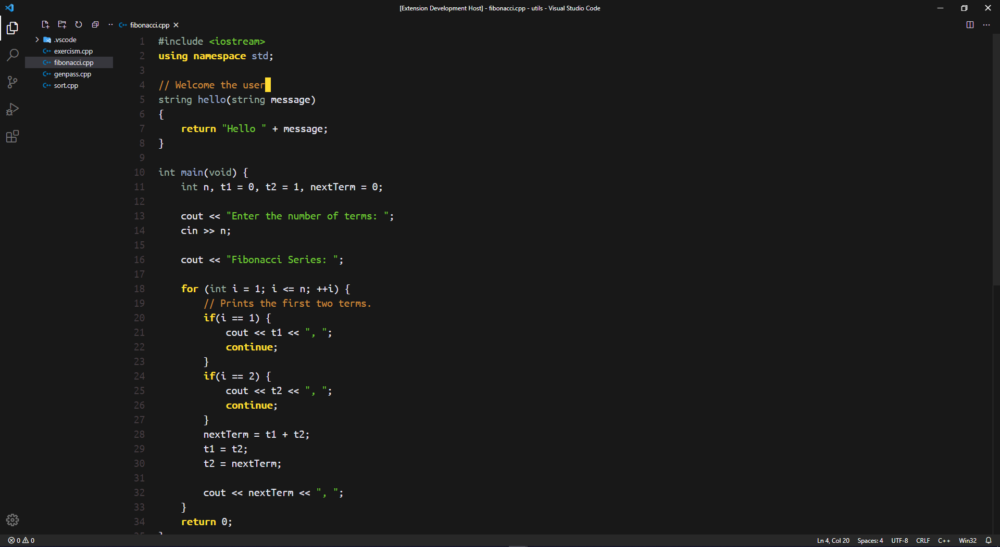

# Gruber Darker VSCode

[Gruber Darker](https://jblevins.org/projects/emacs-color-themes/gruber-darker-theme.el.html) color theme for Emacs by Jason Blevins. A darker variant of the [Gruber Dark](https://daringfireball.net/projects/bbcolors/schemes/) theme for BBedit by John Gruber. Adapted for deftheme and extended by Alexey Kutepov a.k.a. [rexim](https://github.com/rexim). This is a port to Visual Studio Code by Karolis Riaubūnas a.k.a. [Karka-Admin](https://github.com/Karka-Admin).

## Sreenshot


## Installation
Install [vsce](https://github.com/Microsoft/vscode-vsce)  
`npm install --global vsce` 

``` sh
git clone https://github.com/khoroo/gruber-darker-vscode
# alternatively -
# wget "https://github.com/Karka-Admin/gruber-darker-vscode/archive/main.zip" && unzip main.zip

cd gruber-darker-vscode
vsce package --baseContentUrl=file://$(pwd)
```

In Visual Studio Code - open the command palette (*windows* `CTR + SHIFT + P`, *\*nix* `SUPER + SHIFT + P`)  
and select Gruber-Darker.


## Support

Best support for:

    1. C/C++
    2. JavaScript/TypeScript
    4. Python
    5. JSON
    6. HTML
    7. CSS
